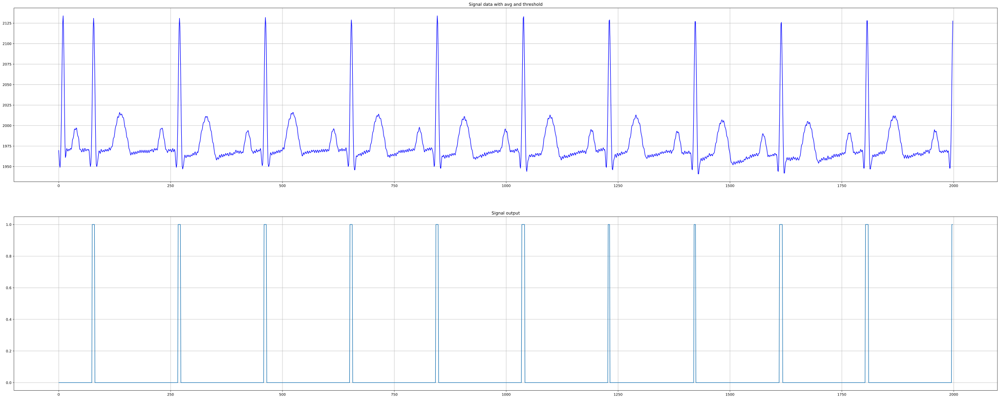

# Z-scores_peak_detection

This is just a python transcription of the algorithm pseudocode given in the referenced article. Please refer to the below URL for documentation of functionallity and proper parameterization.

- https://stackoverflow.com/questions/22583391/peak-signal-detection-in-realtime-timeseries-data

The data included in this project is my ecg signal to test the algorithm. Please check the jupyter file for the result.

[Jupyter file](peak_detection.ipynb)

## Demo

    
    Demo

## Demo in stackoverflow

    
    Demo in stackoverflow

